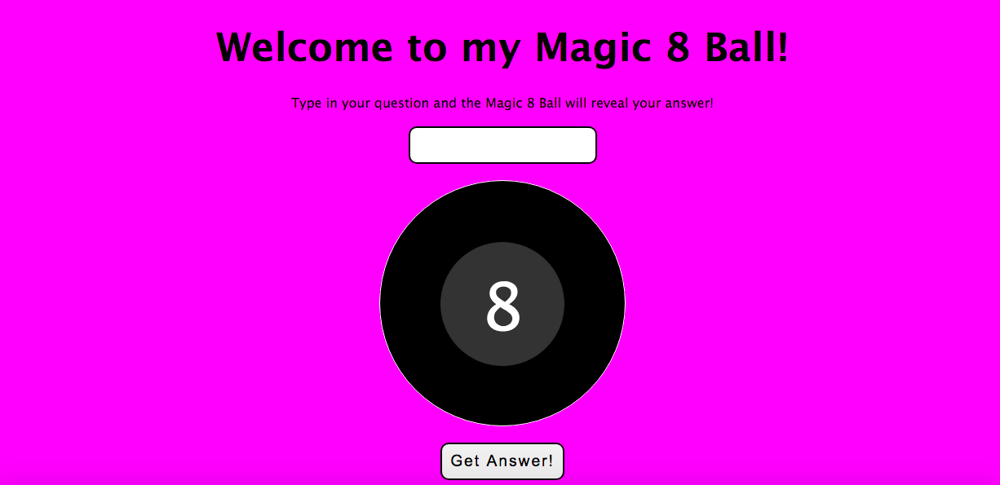
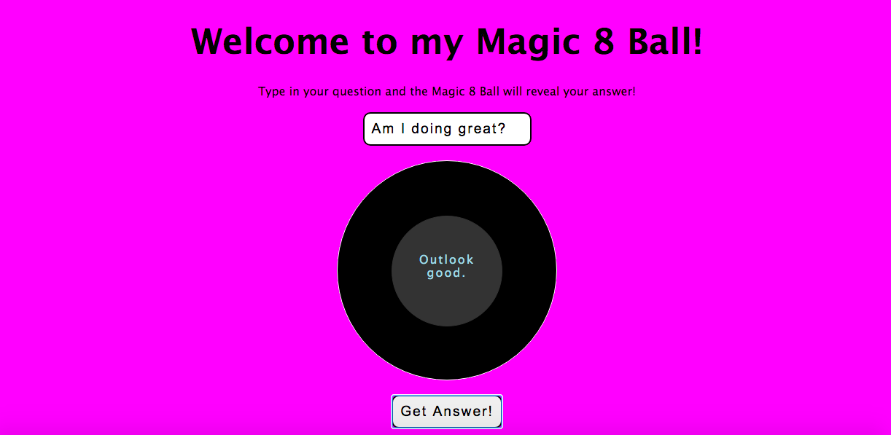

## Magic-8-Ball

This application is an online version of the Magic 8 Ball used for fortune-telling or seeking advice.  The user types in their question into the first input and then clicks on the button with the text "Get Answer!"  The answer is then revealed in the middle of the 8 ball.  This application was created using HTML5, CSS3, and JavaScript.

Deployed: https://caseofbase18.github.io/magic-8-ball/

